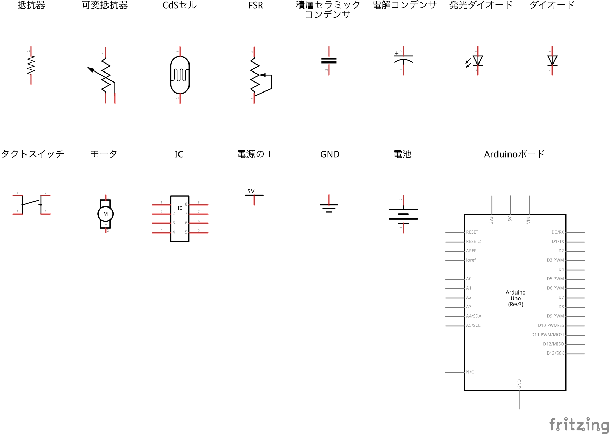

# 配線図と回路図

本書では、電子回路入門者にとってのわかりやすさを優先し、部品間の配線を実物に近い図で示した配線図を用いて説明しました。配線図以外で電子回路を表す方法としては、部品をシンボルで表し、その論理的な接続を示す回路図が広く用いられており、特に複雑な電子回路において有効です。そこで、本書の内容からさらに先のことを学びたいという方の参考になるよう、掲載した配線図から主なものを抜粋し、対応する回路図とセットにしたものを配布いたします。

なお、回路図で用いる記号については、日本やアメリカ、欧州といった地域ごとに微妙に異なるため、配線図や回路図、プリント基板を作成するための統合CADツール「[Fritzing](http://fritzing.org/)」に標準でバンドルされているライブラリのものを採用しています。

また、本書の配線図は2色刷に最適化するためにIllustratorで作成し、さらに細かな部分にも調整をくわえているため、ここで配布しているものとは異なります。

## クレジット

* 配線図用部品の作図：[蛭田直（Sunao Hiruta）](https://github.com/SunaoHiruta)
* 配線図及び回路図の作図：[小林茂（Shigeru Kobayashi）](https://github.com/kotobuki)

## ライセンス

* Fritzingの部品ライブラリに倣い、[クリエイティブ・コモンズ・ライセンス 表示 - 継承 4.0 国際](https://creativecommons.org/licenses/by-sa/4.0/deed.ja)で提供します